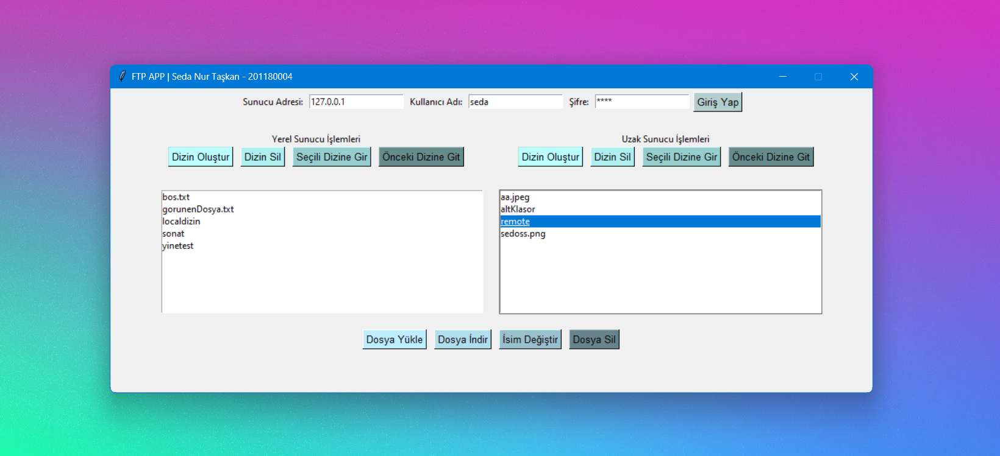

# Getting Started with FTP Client in Python

This is a simple FTP client implemented in Python. It can be used to connect to an FTP server and perform various operations like uploading, downloading, and deleting files.

<p align="center">

</p>

## Prerequisites

Before you start, you need to have Python 3.10, pyftpdlib, tkinter, ftplib installed on your machine.

## Running the Application

To run the application, execute the following command:

```
cd server
python server.py
```

To run the frontend, execute the following command:

```
cd client
python client.py
```
