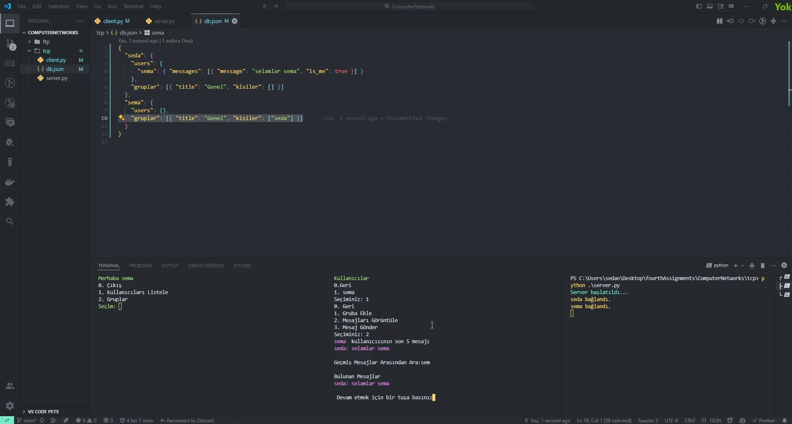

# Getting Started with TCP Communication in Python

This is a simple application that demonstrates how to establish a TCP connection between a server and a client using Python. Clients can send messages between each other.

<p align="center">

</p>

## Prerequisites

Before you start, you need to have Python 3.10, ftplib installed on your machine.

## Running the Application

To run the application, execute the following command:

```
cd server
python server.py
```

To run the frontend, execute the following command:

```
cd client
python client.py
```
